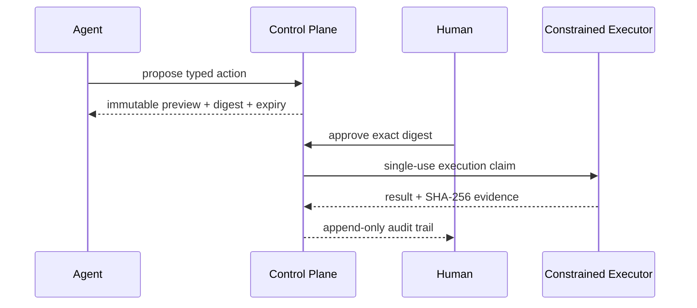

# Governed Agent Plane


A local-first control plane for previewing, approving, executing, and auditing agent actions.

Agent frameworks are good at calling tools; they are less consistent at proving that the executed action is exactly what a person approved. Governed Agent Plane places a durable policy boundary between intent and side effects. Every action has an immutable digest, expiry, preview, named approver, single-use execution claim, and evidence record.

## Who it is for

- Agent builders who need explicit human approval boundaries
- Teams prototyping governed automation without deploying a service
- Reviewers who need to reconstruct what happened from local evidence

## Run it

Requires Python 3.11+ and has no runtime dependencies.

```bash
git clone https://github.com/mahsan07/governed-agent-plane.git
cd governed-agent-plane
python -m pip install -e .
governed-agent-plane --state .state --workspace .workspace propose write_text \
  --id action-1 --requested-by planner \
  --payload '{"path":"report.txt","text":"Verified output\n"}'
governed-agent-plane --state .state --workspace .workspace preview action-1
governed-agent-plane --state .state --workspace .workspace approve action-1 --approver human
governed-agent-plane --state .state --workspace .workspace execute action-1 --executor local-executor
governed-agent-plane --state .state --workspace .workspace audit
```

Use `uv sync` and `uv run governed-agent-plane ...` if you prefer uv. PowerShell users can run `examples/demo.ps1`.

## Governed lifecycle



The MVP executor intentionally supports only `write_text`, `append_text`, and `make_directory`, all confined to the configured workspace. There is no arbitrary shell command, network connector, or hidden credential store.

## What is different

This project is not another agent loop. It is a narrow governance layer that can sit in front of many runtimes. Approval is bound cryptographically to the action payload, expires, and cannot be replayed. The executor receives only a previously approved, locally inspectable action.

It does not yet implement multi-user identity, cryptographic signatures, rollback, or distributed state. Those are explicit next-stage concerns rather than implied guarantees.

## Verify it

```bash
python -m unittest discover -s tests -v
```

See [architecture](docs/ARCHITECTURE.md), [portfolio ecosystem](docs/ECOSYSTEM.md), [product definition](docs/PRODUCT.md), [safety boundaries](docs/SAFETY.md), [roadmap](docs/ROADMAP.md), and [status](STATUS.md).

MIT licensed.
