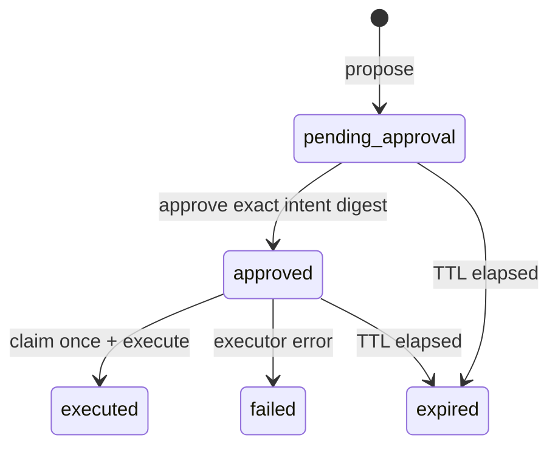
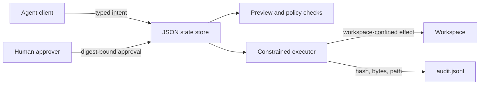

# Architecture

## Trust boundary

The control plane stores action records separately from the target workspace. `preview` resolves the target and describes the effect without changing it. `approve` records the current intent digest. `execute` recalculates that digest, checks expiry and status, creates a single-use claim file, then invokes a constrained built-in action.

## Security properties

- Relative paths are resolved and checked against the workspace root.
- Approval covers ID, kind, payload, requester, creation, and expiry.
- A claim file prevents replay after execution begins.
- The audit log is append-only at the application layer.

Local users with direct filesystem write access can still alter state or logs. Production use would require authenticated identities, tamper-evident storage, and stronger concurrency controls.
