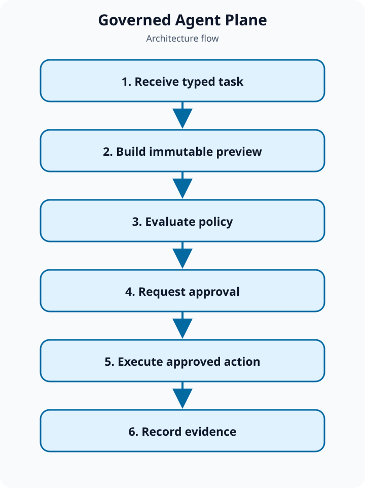
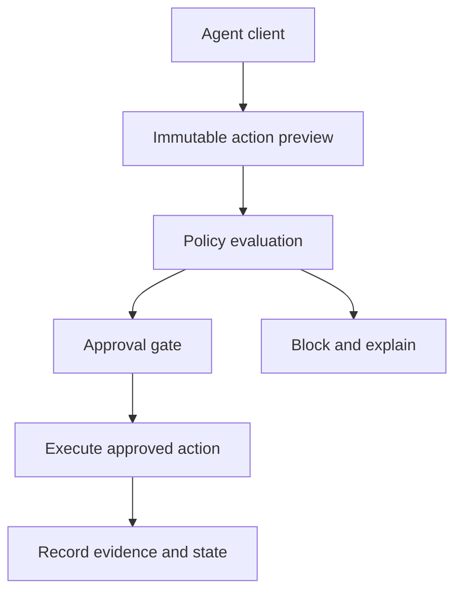
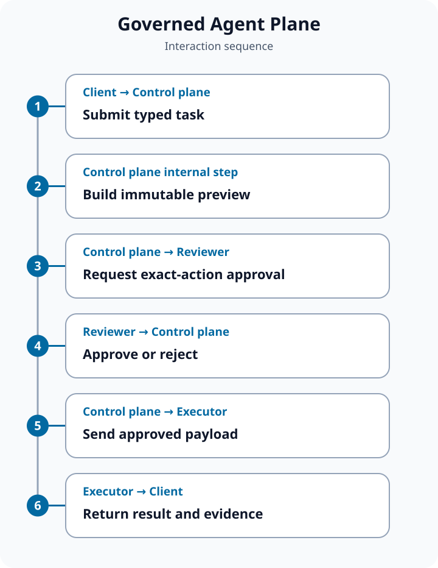
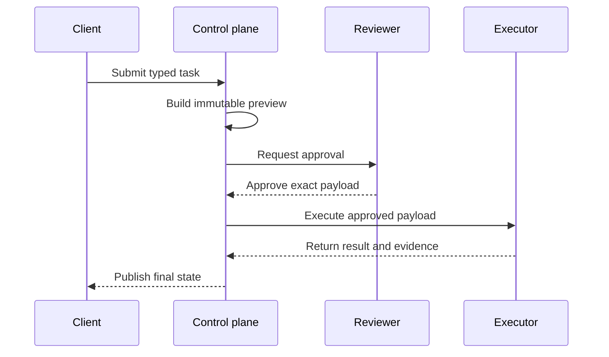

# Governed Agent Plane diagrams

## Governed action flow

### Mermaid source

```mermaid
flowchart TD
  Client["Agent client"] --> Preview["Immutable action preview"]
  Preview --> Policy["Policy evaluation"]
  Policy --> Approval["Approval gate"]
  Approval --> Execute["Execute approved action"]
  Execute --> Evidence["Record evidence and state"]
  Policy --> Block["Block and explain"]
```

## Approval sequence

### Mermaid source

```mermaid
sequenceDiagram
  participant C as Client
  participant P as Control plane
  participant U as Reviewer
  participant X as Executor
  C->>P: Submit typed task
  P->>P: Build immutable preview
  P->>U: Request approval
  U-->>P: Approve exact payload
  P->>X: Execute approved payload
  X-->>P: Return result and evidence
  P-->>C: Publish final state
```
